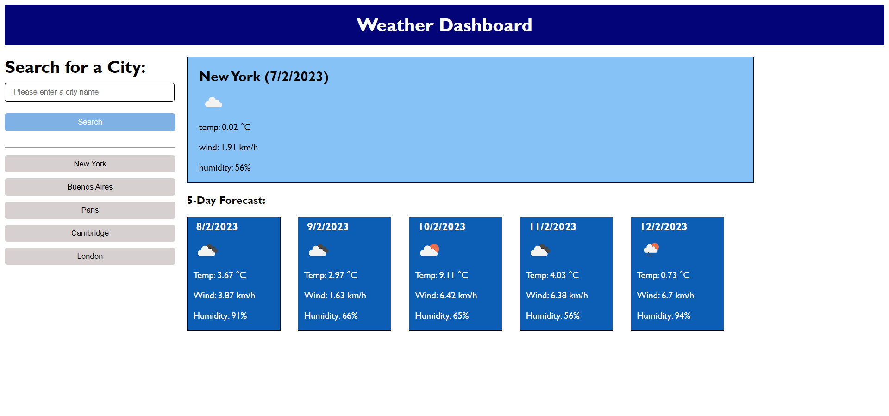

# Weather Dashboard: A weather service for busy travellers (Challenge: Week 8)

## Description
The aim of this project was the access the Open Weather API to provide a 5-day forecast for any city the user wishes to look up. As 5-day forecasts on Open Weather require latitude and longitude coordinates for the location of interest, these first needed to be obtained in order to search for relevant weather data. The weather dashboard provides two methods of retrieving weather forecasts; the first is through a search form where the user enters a city name; the second consists of a series of buttons which store the names of cities from previous searches. The names of these cities are retained in 'localStorage' and the buttons generated from these stored names can be clicked to acquire a weather forecast without the need to retype the name of a previously searched location. Once a city name is determined a URL is constructed to acquire its coordinates accessing Open Weather's "Geocoding API" using the ajax() method. A second search through Open Weather's "5 day weather forecast" API, using these coordinates, provides an object with weather forecasts at three-hour intervals over the five days following the time of search. Variables constructed from time and date information provided on Moment.js were employed to search, by date, for future weather forecasts in order to construct an accurate 5-day forecast for the weather dashboard.

## Installation
N/A

## Usage
To search for weather by city name, type the city of interest into the form, then click "Search" or press enter. A 5-day forecast will be displayed and a button added to the menu so that weather for this city can be acquired again without the need to retype its name into the search form.

## Credits
N/A

## License
N/A

## https://davidbluelamassu.github.io/Weather-Dashboard/

